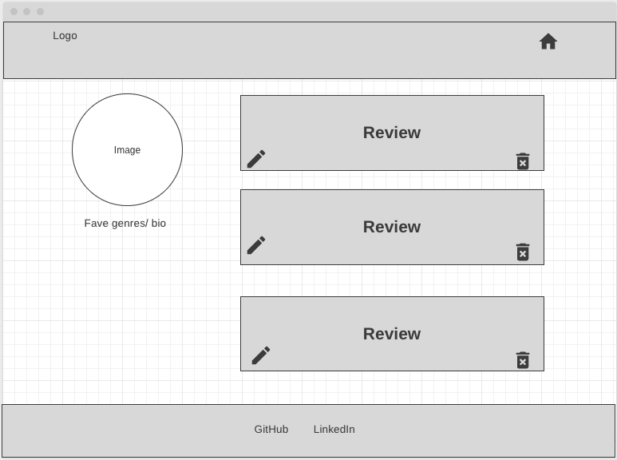

# dime <!-- omit in toc -->
- [Overview](#overview)
- [MVP](#mvp)
  - [Goals](#goals)
  - [Libraries and Dependencies](#libraries-and-dependencies)
  - [Client (Front End)](#client-front-end)
    - [Wireframes](#wireframes)
    - [Component Tree](#component-tree)
    - [Component Hierarchy](#component-hierarchy)
    - [Time Estimates](#time-estimates)
  - [Server (Back End)](#server-back-end)
    - [ERD Model](#erd-model)
- [Post-MVP](#post-mvp)
- [Code Showcase](#code-showcase)
- [Code Issues & Resolutions](#code-issues--resolutions)

<br>

## Overview

_**dime** is an application that allows you to create an account where you can view and create ratings and comments on series and movies offered on different streaming platforms._


<br>

## MVP

> _The **dime** MVP is to create full crud capability for creating and adding reviews and ratings to your account. The user will be able to see and edit their ratings and comments from their account page._


<br>

### Goals

- _Create user profile to store and view rating and comments._
- _Full CRUD capability for ratings and comments components._
- _Create seed data tp setup API._
- _Execture full-stack application development._


<br>

### Libraries and Dependencies

|     Library      | Description                                |
| :--------------: | :----------------------------------------- |
|      React       | _fuels the application enviornment_ |
|   React Router   | _allows user to navigate application without refreshing_ |
|       Ruby       | _open source programming language focusing on simplifying code and adding effectiveness_ |
|     Rails      | _framework providing structure for Ruby_ |


<br>

### Client (Front End)

#### Wireframes

- Desktop Landing:


- Mobile Landing and Hamburger Dropdown


- Logged On Landing for Mobile and Desktop


- Sign In Card for Mobile and Desktop


- Sign Up Card for Mobile and Desktop


- Platform Landing for Mobile and Desktop


- Series Page for Mobile and Desktop


- User page for Mobile and Desktop



- Review Card for Mobile and Desktop


#### Component Hierarchy

``` structure

src
|__ App.js/
|__ components/
    |__Header/
       |__Header.jsx
       |__Header.css
    |__ Nav/
       |__Nav.jsx
       |__Header.css
    |__ Login/
       |__Login.jsx
       |__Login.css
    |__ Register/
       |__Register.jsx
       |__Register.css
    |__Users/
       |__ CreateUser/
          |__ CreateUser.jsx
          |__ CreateUser.css
       |__ ShowUser/
          |__ ShowUser.jsx
          |__ ShowUser.css
       |__ UpdateUser/
          |__ UpdateUser.jsx
          |__ UpdateUser.jsx   
    |__Reviews/
      |__ CreateReviews/
          |__ CreateReviews.jsx
          |__ CreateReviews.css
       |__ ShowReviews/
          |__ ShowReviews.jsx
          |__ ShowReviews.css
       |__ UpdateReviews/
          |__ UpdateReviews.jsx
          |__ UpdateReviews.jsx
       |__ DeleteReviews/
          |__ DeleteReviewsjsx
          |__ DeleteReviews.css
|__ services/
    |__api-config.js
    |__series.js
    |__users.js
    |__reviews.js

```

#### Component Tree


#### Time Estimates

| Task                | Priority | Estimated Time | Time Invested | Actual Time |
| ------------------- | :------: | :------------: | :-----------: | :---------: |
| Add Sign in/ Log in Form    |    H     |     5 hrs      |     TBD     |    TBD   |
| Create seed data |    H     |     6 hrs      |     TBD  | TBD
| Front-End CSS (boilerplate)|    L   |     4 hrs      |     TBD  | TBD
| Advanced Front-End CSS |    H     |     12 hrs      |     TBD  | TBD
| Deployment |    H     |     4 hrs      |     TBD  | TBD
| Create CRUD Actions |    H     |     25 hrs      |     TBD    |     TBD     |
| TOTAL               |          |     62 hrs      |     TBD    |     TBD     |


<br>

### Server (Back End)

#### ERD Model

> Use this section to display an image of a computer generated ERD model. You can use draw.io, Lucidchart or another ERD tool.

<br>

***

## Post-MVP

> Use this section to document ideas you've had that would be fun (or necessary) for your Post-MVP. This will be helpful when you return to your project after graduation!

***

## Code Showcase

> Use this section to include a brief code snippet of functionality that you are proud of and a brief description.

## Code Issues & Resolutions

> Use this section to list of all major issues encountered and their resolution.